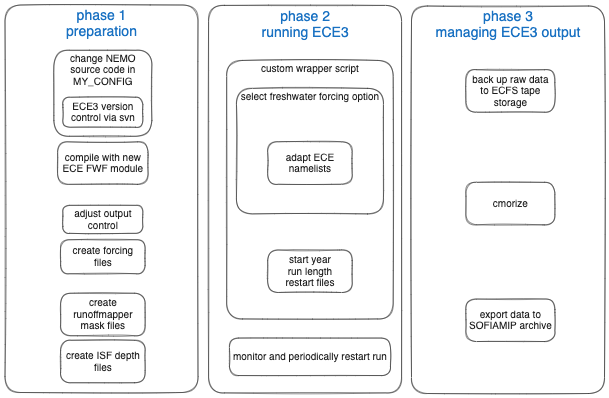

# Workflow to run EC-Earth3 with Freshwater Forcing
This repository contains both documentation and necessary code of the workflow to run freshwater forcing experiments with EC-Earth3. 

## Documentation
- all documentation markdown files are stored in `documentation/`, but the notebooks in `code` also contain relevant commented
- the [General ECE3-FWF Workflow](<documentation/ECE3-FWF_workflow.md>) document goes through the all steps in the 3 phases shown below and links to the other markdown notes

\
Fig: This is an overview of the various adjustment and steps that need to be taken to run the freshwater experiments.

## Code / notebooks
- stored in `code/`

### NEMO adjustments
- the changes can be found in the the EC-Earth svn branch ``
- needs to be re-compiled with changes

### forcing files
- forcing files are ocean grid (in our case, ORCA1) files with fluxes in kg/m^2/s
- forcing files can be created for each year or as a climatology, both will contain 12 monthly values

#### SOFIAMIP forcing
- 

#### arbitrary forcing time series
- the forcing file for a subsequent year can, in principle, be created after each leg